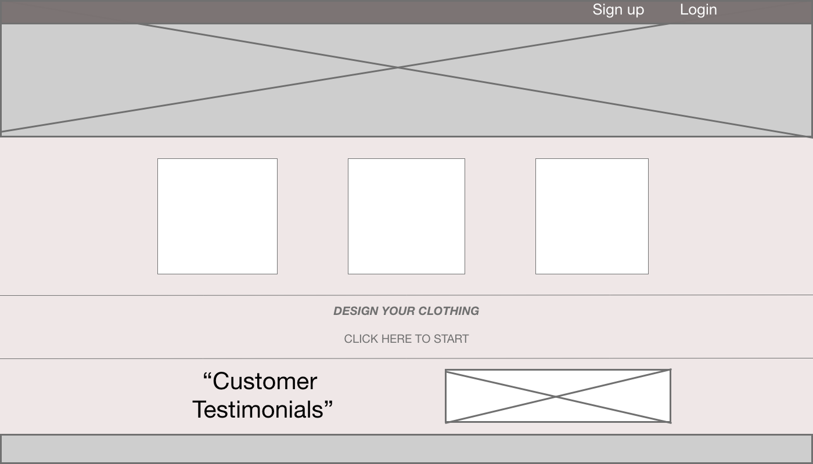
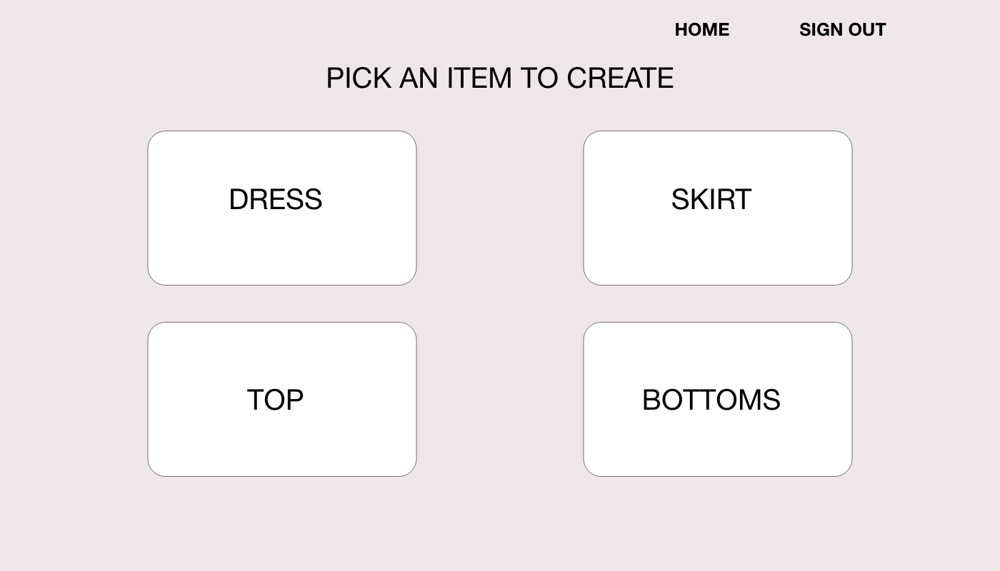
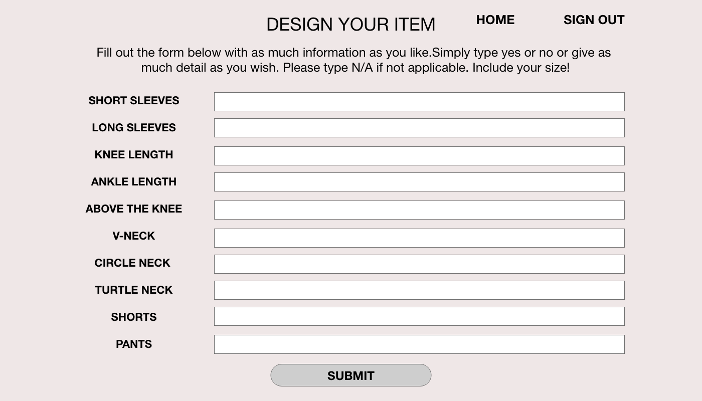
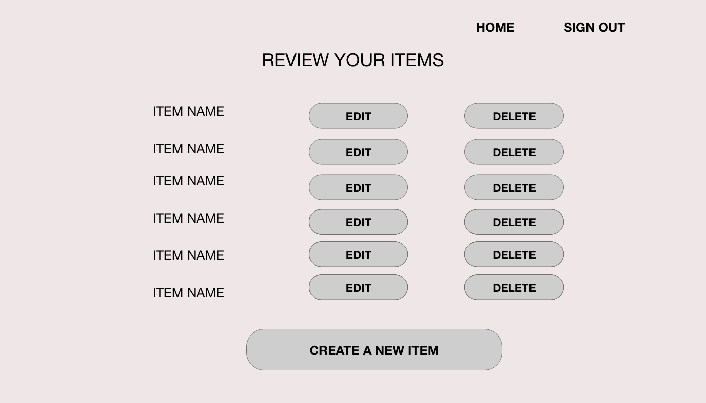

# FILTHY FASHION <!-- omit in toc -->

- [Overview](#Overview)
  - [Core Features](#Core-Features)
  - [Goals](#Goals)
  - [Team](#Team)
- [MVP](#MVP)
  - [Client (Front End)](#Client-Front-End)
    - [Wireframes](#Wireframes)
    - [Component Hierarchy](#Component-Hierarchy)
    - [Component Breakdown](#Component-Breakdown)
    - [Component Estimates](#Component-Estimates)
  - [Server (Back End)](#Server-Back-End)
    - [ERD Model](#ERD-Model)
    - [Post-MVP](#Post-MVP)
    <!-- - [Data Heirarchy](#Data-Heirarchy)
    - [Data Heirarchy](#Data-Heirarchy-1)
  - [Dependencies](#Dependencies) -->
<!-- - [Post-MVP](#Post-MVP) -->
<!-- - [Code Showcase](#Code-Showcase)
- [Code Issues & Resolutions](#Code-Issues--Resolutions) -->

<br>

## Overview

_**Filthy Fashion** is a unique fashion web application where users can create an account and build a clothing item. A user has the option of selecting a dress, skirt, shirt, or bottoms and selecting different variations of the clothing. The user has the option of choosing the colors, dress length, skirt length, short sleeve, or long sleeve. For the bottoms they user has the option of selecting shorts or pants and choosing the color. This fashion forward web application gives the user freedom to build the a clothing items to their hearts desires._

### Core Features

_Flithy Fashion has multiple features tailored to provide the user a one of a kind fashion experience. The core features are listed below._

- _The user has the ability to create an account._
- _Once logged in, the user can choose a clothing item._
- _The user has the ability to select multiple variations of the clothing item._
- _Variations include selecting the color, length, sleeve length, or bottoms type._

### Goals

- _Full CRUD for the clothing items_
- _Implement Authentication_
- _All features are functional_
- _Each clothing item created is saved to individual users_


### Team

Created, designed, and developed by [Cherelle Townes](https://github.com/cherelletownes) for the General Assembly Software Engineering Immersive (February '20 Cohort) Unit 4 Project.


<br>

## MVP

_The **Filthy Fashion** MVP will function as a fullstack app. The backend will be built on a Ruby on Rails server, exposing RESTful JSON endpoints. have a RESTful JSON API. lorem ipsum dolor sit amet, consectetur adipiscing elit. Phasellus dapibus fermentum risus vitae bibendum. Integer vel ipsum mollis odio sollicitudin ornare eu vel ex. In quis fringilla velit, ac maximus quam. Etiam eget placerat neque. Aenean faucibus sem non nisi lobortis ullamcorper._


## Client (Front End)

- Interactive **React** app, built using `npx create-react-app`.
    - Have at least 8 separate, rendered components in an organized and understandable React file structure.
  - Utilize functional and class React components appropriately.
  - Utilize state and props in your components efficiently.
  - Use _only_ React for DOM Manipulation.
- Consume data from your **Ruby on Rails API**, and render that data in your components.
- Utilized **React Router**, for client-side routing.
- Utilized Authentication, permitting the user to:
  - Register, login, and send authenticated requests.
  - Perform `index` or `show` actions, **whether or not they are logged in**.^
  - Perform `create`, `update`, and `delete` actions **when logged in**.


#### Wireframes




- Desktop/Mobile Landing


- Desktop Page 2


- Desktop Page 3



- Desktop Page 4



- Desktop Page 5


- Desktop Page 6



- Desktop Page 6

#### Component Hierarchy

``` structure

src
|__ assets/
      |__ fonts
      |__ graphics
      |__ images
      |__ mockups
|__ components/
      |__ Header.jsx
      |__ Navbar.jsx
      |__ Clothing-Variations-Form.jsx
      |__ Colors-Form.jsx
      |__ Sign-up.jsx
      |__ Log-in.jsx
      |__ Create-Clothing-Item.jsx
      |__ Edit-Clothing-Item.jsx
      |__ Delete-Clothing-Item.jsx
      |__ All-Clothing-Items.jsx

```

#### Component Breakdown


|  Component   |    Type    | state | props | Description                                                      |
| :----------: | :--------: | :---: | :---: | :--------------------------------------------------------------- |
|    Header    | functional |   n   |   n   | _The header will contain the navigation and logo._               |
|  Navigation Bar | functional |   n   |   n   | _The navigation will provide a link to home, login, and sign-out._       |
|   Clothing Variation Form    |   class    |   y   |   y   | _The clothing variation form will render type of variations a user can pick to create item._      |
| Colors Form | class |   n   |   n   | _The clothing variation form will render type of colors a user can pick to create item._                 |
|    Sign-Up Form    | class |   n   |   n   | _The sign-up form will allow the user to register for an account_ |
|    Log-in Form   | functional |   n   |   n   | _The log-in form will allow the user to log-in to an account._               |
|  Create-Clothing-Item | class |   y   |   y   | _The create clothing item will allow to user to select a clothing item they wish to create._       |
|   Update-Clothing-Item   |   class    |   y   |   y   | _The update clothing item will allow to user to edit their clothing item after it was created._      |
| Delete-Clothing-Item | class |   y   |   y   | _The delete clothing item will allow the user to delete a clothing item they created._                 |
|    All-Clothing-Items    | class |   y   |   y   | _The all clothing items component will allow the user to see all clothing items the created._ |


#### Component Estimates


| Task                | Priority | Estimated Time | Time Invested | Actual Time |
| ------------------- | :------: | :------------: | :-----------: | :---------: |
| Add Header    |    L     |     1 hr      |    TBD     |    TBD    |
| Create CRUD Actions |    H     |     5 hrs      |     TBD     |     TBD     |
| Add Nav Bar    |    L     |     1 hr      |    TBD     |    TBD    |
| Creating Rails App |    H     |     1 hrs      |     TBD     |     TBD     |
| CSS for entire website    |    H    |     12 hrs      |    TBD     |    TBD    |
| Functionality  |    H     |     6 hrs      |     TBD     |     TBD     |
| Backend    |    H     |     12 hrs      |    TBD     |    TBD    |
| All components |    H     |     12 hrs      |     TBD     |     TBD     |
| TOTAL               |          |     50 hrs      |     TBD     |     TBD     |

<br>

### Server (Back End) <!-- omit in toc -->

- Backend built with a **RESTful JSON API**.
  - Built with **Ruby on Rails** server, exposing RESTful JSON endpoints.
  - Database with 5 tables.
    - 1 user table. 1:m - partial-CRUD controller action (`create`)
    - 1 clothing type table. m:m full-CRUD full-CRUD (`index`, `show`, `create`, `update`, `delete`) 
    - 1 clothing variation. m:m full-CRUD (`index`, `show`, `create`, `update`, `delete`) 
    - 1 color table. m:m full-CRUD (`index`, `show`, `create`, `update`, `delete`) 
  - **Rails** is used to define models for interacting with the database.
  - Authentication implemented using **JWT**.


#### ERD Model


-  Computer generated ERD model.


-  Computer generated relationship table.

<!-- #### Data Heirarchy

> Use this section to display the database, table, and attribute heirarchy.

``` structure

database_db
|__ users/
|__ resources/
|__ posts/

```

#### Data Heirarchy

> Use this section to display the expected endpoints from your API.

<br>

### Dependencies

> Use this section to list all supporting libraries and dependencies, and their role in the project.

|     Library      | Description                                |
| :--------------: | :----------------------------------------- |
|      React       | _Lorem ipsum dolor sit amet, consectetur._ |
|   React Router   | _Lorem ipsum dolor sit amet, consectetur._ |
| React SemanticUI | _Lorem ipsum dolor sit amet, consectetur._ |
|     Express      | _Lorem ipsum dolor sit amet, consectetur._ |
|  Express Router  | _Lorem ipsum dolor sit amet, consectetur._ |

<br> 

***

> This section is not necessary for your pitch! -->

## Post-MVP

Allow the user to only see clothing variations according to the item selected. For example, if the user selected bottoms, the user will only see clothing variations for shorts or pants. They will not see sleeve options or neckline options. Add a color picker for the user to pick a color for their item.

***

<!-- ## Code Showcase

> Use this section to include a brief code snippet of functionality that you are proud of and a brief description.

## Code Issues & Resolutions

> Use this section to list of all major issues encountered and their resolution, if you'd like. -->